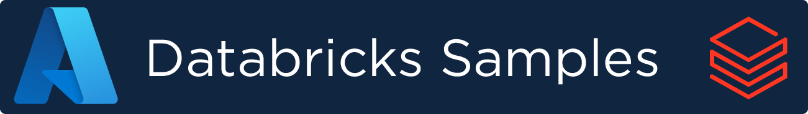
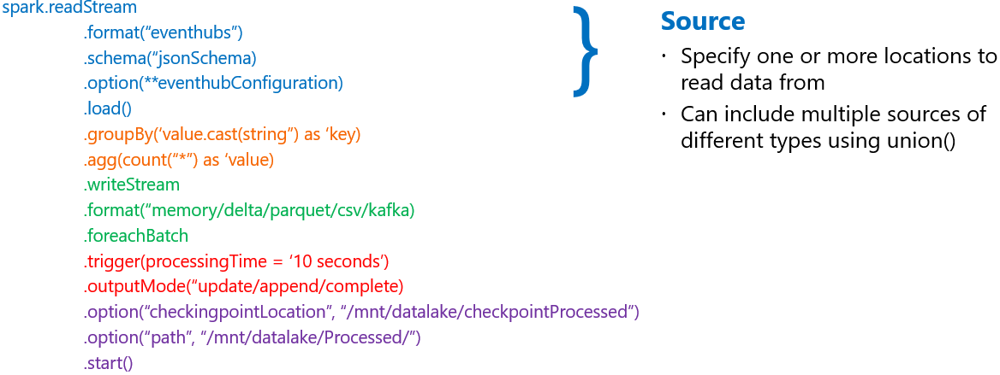
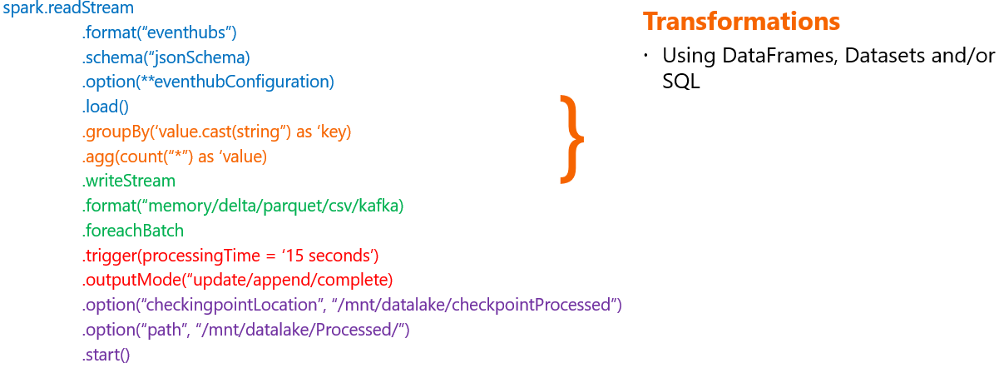
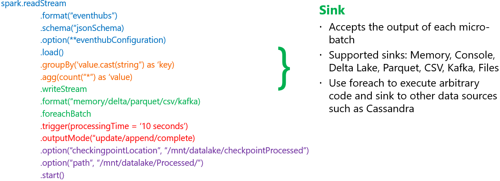
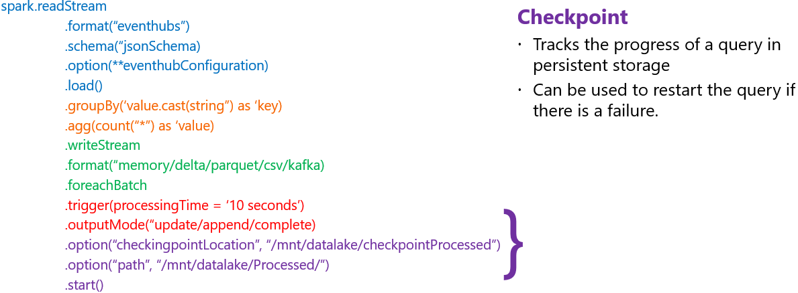

## 

This repo contains Databricks Basics, Delta Lake, Delta Live Table, Structured Streaming and ML examples designed to get customers started with building, deploying and running Notebooks and Pipelines in Databricks.

## Content
* Basics
  * Managing DBFS
  * RDDs and Data Frames
  * Basic Transformations
  * Basic Aggregations and Transformations
  * SQL - Tables, Data Frames and Datasets
  * SQL - Basic SQL Transformations
  * Azure Key Vault
  * Mounting ADLS 
  * Functions and UDFs
  * Visualizations
* Delta Lake
  * Diving Into Delta Lake
  * Delta Architecture - Bronze, Silver and Gold
  * Delta Lake Basics
  * Delta Lake Time Machine
* Streaming Pipelines
  * Azure Databricks Using Event Hubs
  * Structured Streaming

## Anatomy of a Streaming Query
If you know the anatomy of a Streaming Query it will be easier to visualize what the streaming process is doing

